# Furniture Store Streaming Analytics - Data Engineering Project

## Table of Contents
- [Introduction](#introduction)
- [System Architecture](#system-architecture)
- [What You'll Learn](#what-youll-learn)
- [Technologies](#technologies)
- [Walkthrough](#walkthrough)

## Introduction
The purpose of this project is to build a data pipeline that will collect daily records from an electronics store, store the raw data in a Cassandra database, aggregate the data into a Postgres database, and then use Superset to visualize the data. The goal is to provide end users with real-time reports.

## System Architecture
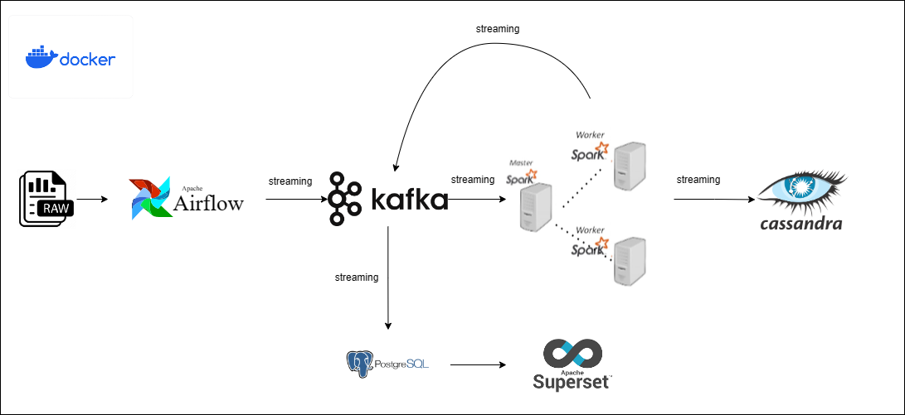

The project is structured with the following components:
- **Data Source**: Tabular data that we generate from code `fake_data.py`.
- **Airflow**: Automate the data pipeline.
- **Kafka**: Process the real-time data 
- **Cassandra DB**: Database for storing raw data table (records)
- **Postgres DB**: Database for storing aggregated data table (reports)
- **Superset**: Visualize the data stream

## System Components
- **fake_data.py**: This code creates daily records of customer transactions, including the type of goods purchased, the quantity purchased, the revenue, and the coordinates of each customer. The records are sent to the `daily_records` topic on Kafka in key-value format. At the end of each day, the records are aggregated into a Parquet file.
- **spark_stream_cassandra.py**: This code creates tables in a Cassandra database to store raw and aggregated records. It then connects to the `daily_records` topic on Kafka to receive data, and uses PySpark to aggregate the data into the following dataframes:
    - `daily_pu_rev`: The number of customers who made purchases, the revenue, and the profit by day.
    - `daily_category_product`: The quantity of goods purchased, the revenue, and the profit generated by the product by day.
    - `daily_address`: The coordinates of the number of customers who made purchases (where are the customers who shop often located).
The data is then sent to the corresponding topics on Kafka.
- **spark_stream_postgre.py**: This code creates tables in a PostgreSQL database. It then connects to the `daily_pu_rev`, `daily_category_product`, and `daily_address` topics on Kafka to pull data into the corresponding tables.

## What You'll Learn
- Faking data, saving into records using Python code
- Setting data tasks automation using Airflow
- Setting streaming processing using Kafka, Pyspark
- Sinking messages from Kafka to Cassandra DB
- Sinking messages from Kafka to Postgres DB
- Visualizing data using Superset

## Technologies
- Python
- Pyspark
- Airflow
- Kafka
- Cassandra DB
- Postgres DB
- Superset

## Walkthrough
1. Download the code and set up Docker environment

- Clone this respository
    ```bash
    git clone https://github.com/hauct/de-furniture-streaming-data-analystics.git
    ``` 

- Open your Docker Desktop, build the containers
    ``` bash
    docker compose up -d
    ```

    Make sure these containers are running in your Docker

    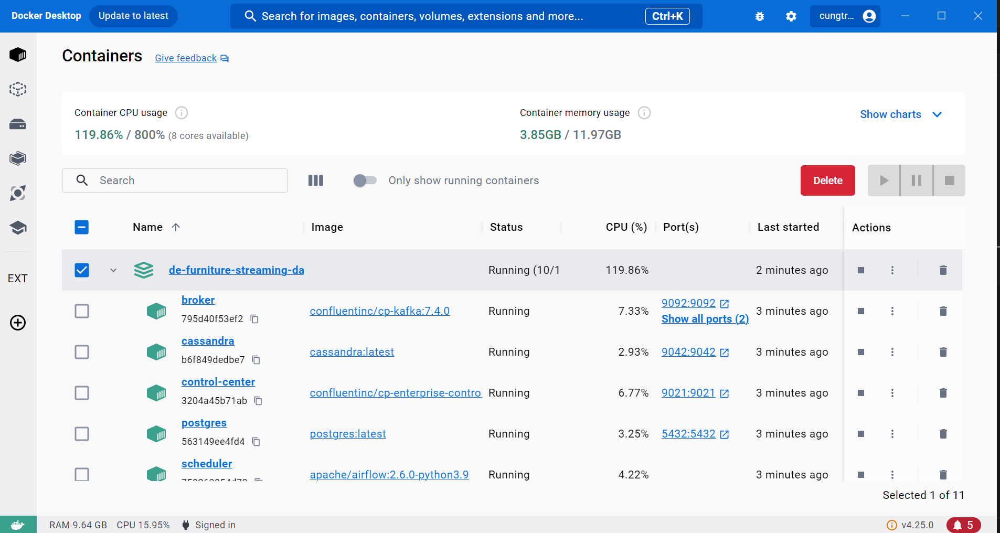

2. Set up pipelines

- Open a terminal and run this code to start Cassandra Stream Consumser:

    ``` bash
    docker exec -it spark-master bash
    python spark_stream_cassandra.py
    ```

    You may need to wait for downloading packages to run this code smoothly. If you get the picture below, everything is OK to move to next step
    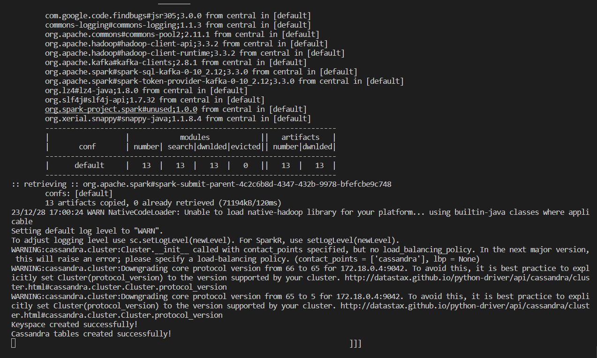

- Open another terminal and run this code to start Postgre Stream Consumser:

    ``` bash
    docker exec -it spark-master bash
    python spark_stream_postgre.py
    ```
    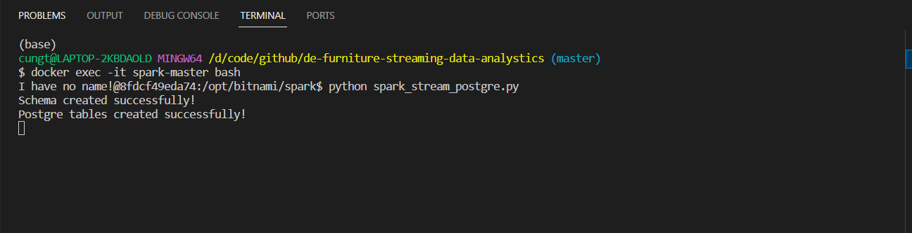

- Click on port `8080:8080` on Docker Desktop to get access to Airflow Webserver. The username and password are `admin`. Run the task `fake_data` to start generate records

    |                                    |                                    |
    |------------------------------------|------------------------------------|
    |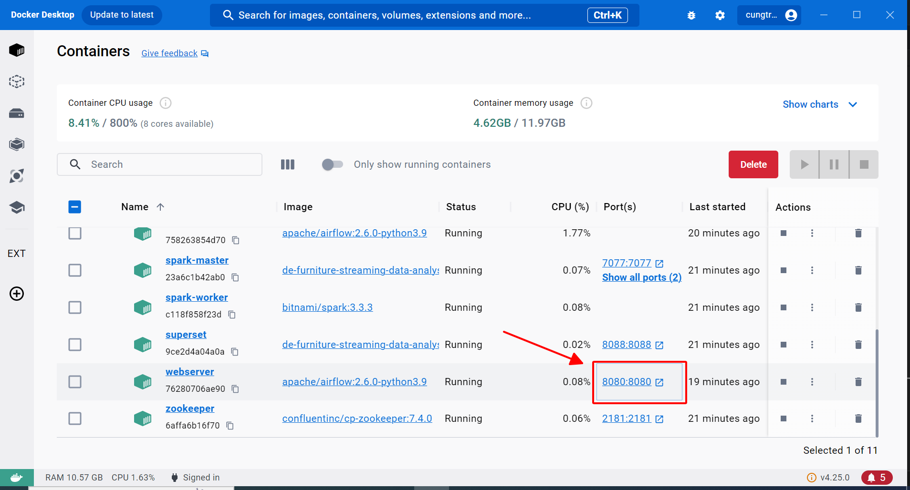|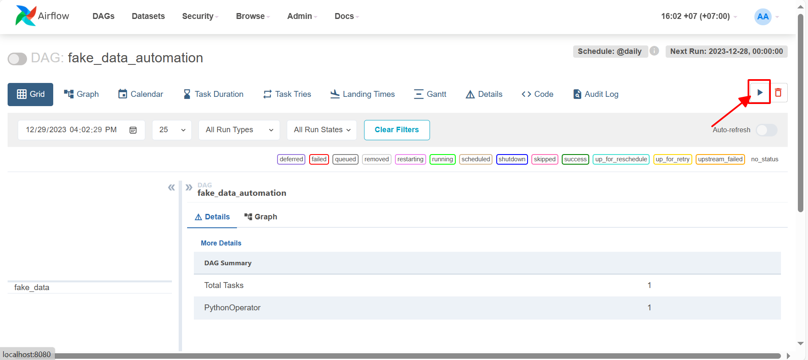|

    - The streaming has already began. Now, you can see in `./records` folder, parquet files are being exported
    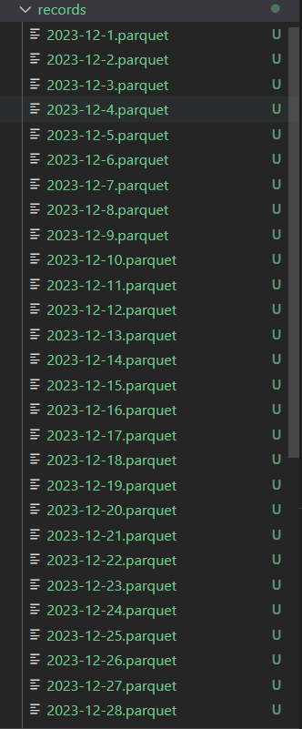

    - In terminal running Cassandra, the process will be displayed
    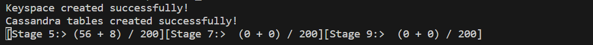

    - You can also check the key-value messages sending to Kafka on Confluent. Click on port `9042:9042` on Docker Desktop to get access to control center of Confluent

3. Visualize the data

- Click on port `8088:8088` on Docker Desktop, Open superset UI and get connect to Postgres DB

    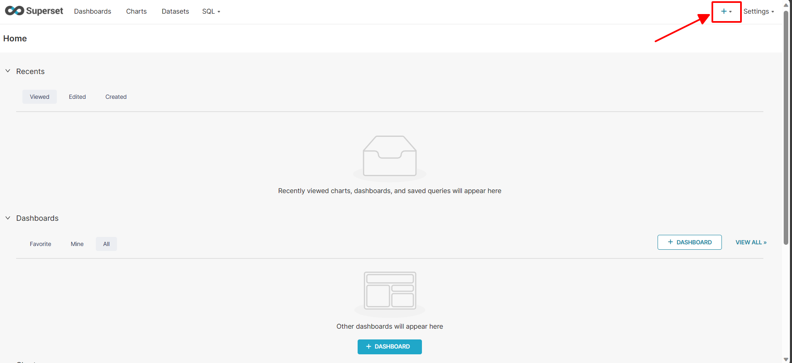

    |                                                          |                                    |
    |----------------------------------------------------------|-----------------------------------------------------------|
    |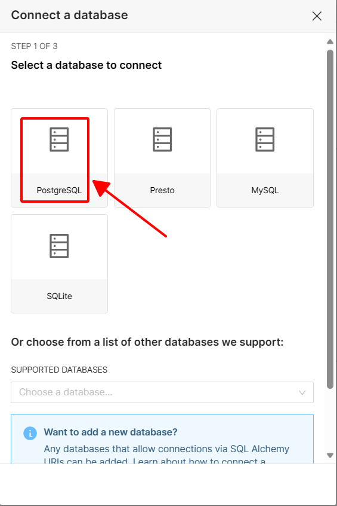|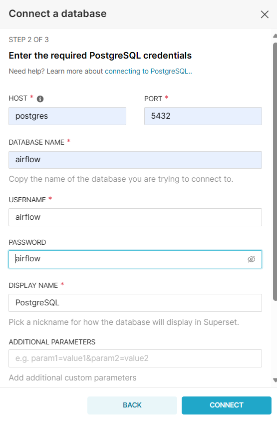|


- Import the file `daily_report_dashboard.zip`. 

    |                                                          |                                    |
    |----------------------------------------------------------|-----------------------------------------------------------|
    |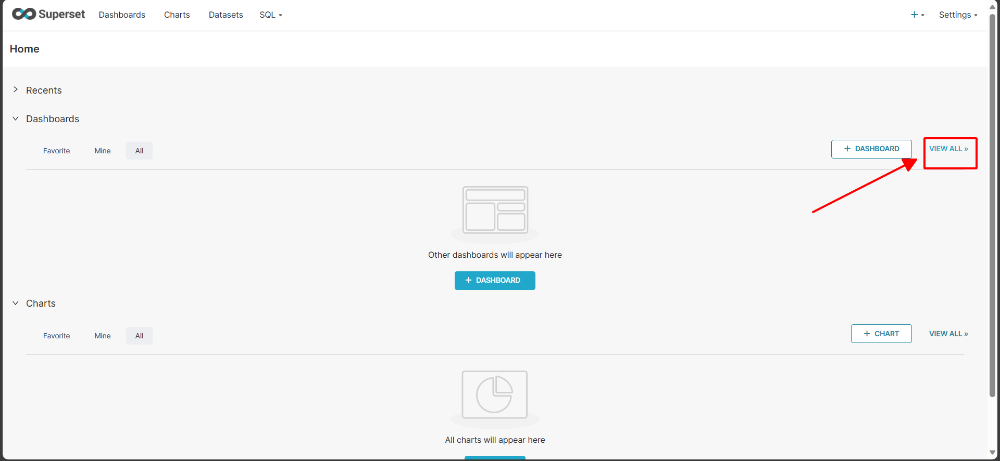|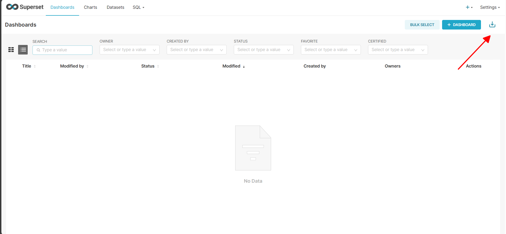|


- This is a basic sample dashboard that I have built to track the daily performance of the store. I highly encourage you to add or modify it as you see fit if you have new insights or perspectives.

    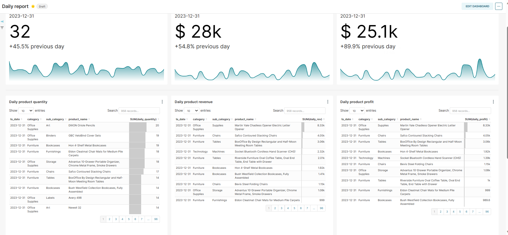
    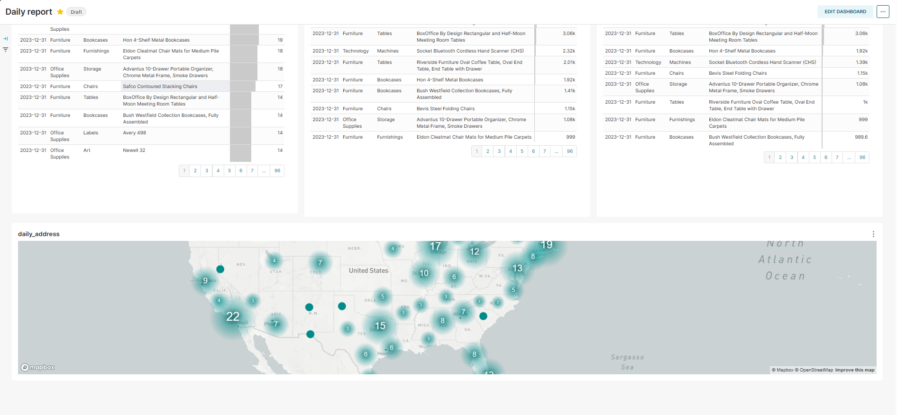


4. **IMPORTANT NOTE**:

- There is a MapBox chart in my dashboard and it require a MAPBOX_API_KEY to show the full map (You can read more about this error [here](https://superset.apache.org/docs/frequently-asked-questions/)). You will need to register a Mapbox account (credit card required) to get a API key. Then, paste it into `MAPBOX_API_KEY` of `./superset/superset_config.py` and re-build the container.

    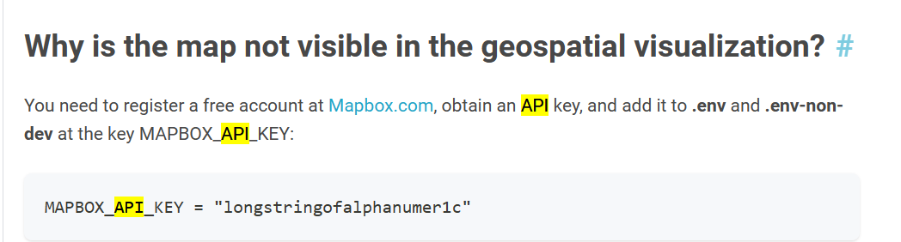
    
And this is the end of my project. Thanks for reading.

